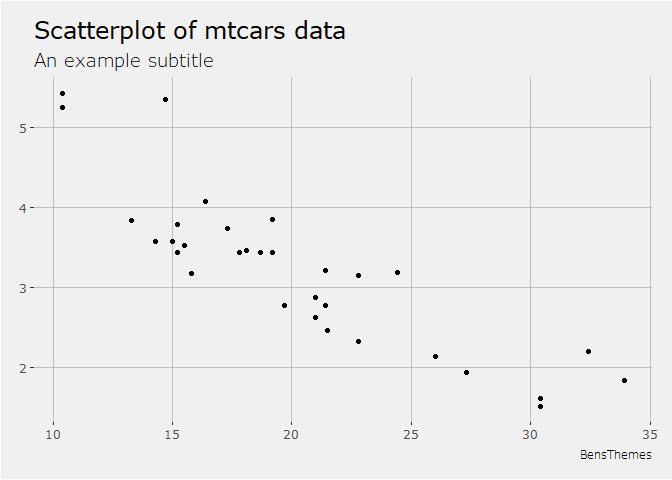
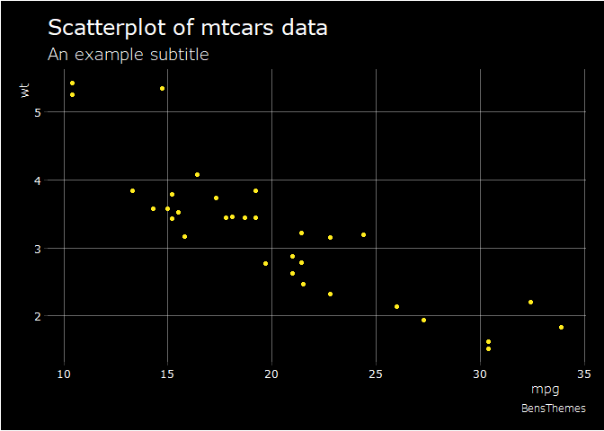
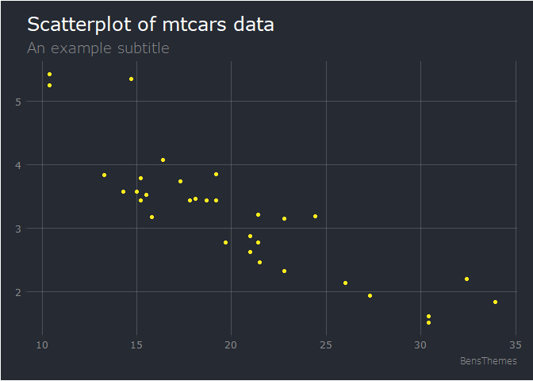

# BensThemes

[](https://github.com/Naereen/StrapDown.js/blob/master/LICENSE)

A package for R that contains the custom themes I use for ggplot2. This
was made for my own personal use but if you would also like to use these
themes follow the steps below.

## Installation

This project is not on CRAN so to download you will need to have the
package devtools for R.

``` r
devtools::install_github("benchaffe/BensThemes")
```

To use the fonts you may also need the package extrafont. Simply follow
the steps below.

``` r
library(extrafont)
font_import()
loadfonts(device = "win")
```

`font_import()` can take around 5 minutes.

## Themes

-   `theme_belightgray` A modern light gray theme.
-   `theme_bedark` A modern dark theme.
-   `theme_bedarkish` This is a lighter dark theme.

## Examples

Note: all themes have the option `axisLabels = FALSE` by default. Simply
set to true like the examples above to see them.

### Light Gray Theme

``` r
ggplot(mtcars, aes(mpg, wt)) +
  geom_point() +
  labs(title = "Scatterplot of mtcars data", 
       subtitle = "An example subtitle", 
       caption = "BensThemes") +
  theme_belightgray(axisLabels = TRUE)
```

<!-- -->

### Dark Theme

``` r
ggplot(mtcars, aes(mpg, wt)) +
  geom_point(color = rgb(255, 235, 30, maxColorValue = 255, alpha = 255)) +
  labs(title = "Scatterplot of mtcars data",
       subtitle = "An example subtitle",
       caption = "BensThemes") +
  theme_bedark(axisLabels = TRUE)
```

<!-- -->

### Dark-ish Theme

``` r
ggplot(mtcars, aes(mpg, wt)) +
  geom_point(color = rgb(255, 235, 30, maxColorValue = 255, alpha = 255)) +
  labs(title = "Scatterplot of mtcars data",
       subtitle = "An example subtitle",
       caption = "BensThemes") +
  theme_bedarkish(axisLabels = TRUE)
```

<!-- -->
